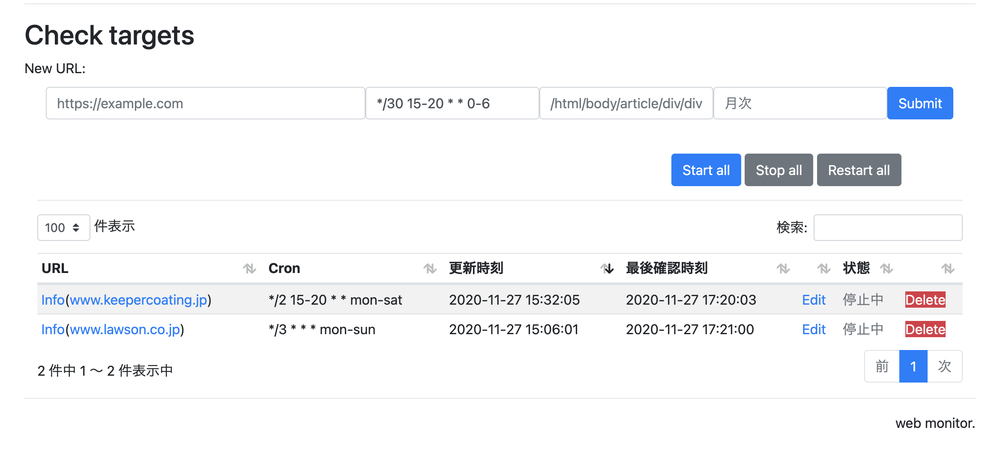

# Monitor web page for changes



#### To start server for testing


#### Start a database server for test
```bash
docker run --name mariadb -e MYSQL_ALLOW_EMPTY_PASSWORD=1 -d   mariadb:latest
```

Then login to database and create user and password for the application.
I use `root` here for convenience.

```sql
SET PASSWORD FOR 'root'@'localhost' = 'root';
```

Copy `flaskenv.sample` to `.flaskenv` and fill out all required information.

```bash
cp flaskenv.sample .flaskenv
```

```text
FLASK_ENV=development  # development|production|testing|default (development)
FLASK_DEBUG=1          # 1 for more debug messages
SECRET_KEY=abd}ddd     # secret key for authentication
REPORT_EMAIL=
SSL_DISABLE=True
DB_SERVER=localhost     # set the hostname of the database here
DB_USER=dbuser          # database username created above
DB_PASSWORD=dbpass      # password for database, remember to update the password
DB_SCHEMA=web_monitor
MAIL_SERVER=smtp.gmail.com   # we use GMail for sending notification 
MAIL_USERNAME=my_gmail@gmail.com   # enter your email address for notification here
MAIL_PASSWORD=secret               # get the password for app here (need to create one, not the normal password)
MAIL_SENDER=my_gmail@gmail.com     # set the email address of sender 
MAIL_RECIPIENT=my_gmail@gmail.com,another_mail@gmail.com  # set the recipient email address here
CHROME_DRIVER=/Users/cuong/localdev/python/flask/web_monitor/chromedriver   # set the path to ChromeDriver
CHROME_OPTIONS=--headless  # can set option of chrome driver here
```


- Creating schema
```bash
./manage.py shell
db.create_all()
```

Next start the scheduler server.

```bash
python scheduler_server.py
```

Then, run following 

```bash
./manage.py runserver
```


#### To start server using gunicorn
```bash
gunicorn --bind 127.0.0.1:5000 manage:app
```

check for exposed ip

```bash
docker inspect -f '{{range .NetworkSettings.Networks}}{{.IPAddress}}{{end}}' mariadb
```


